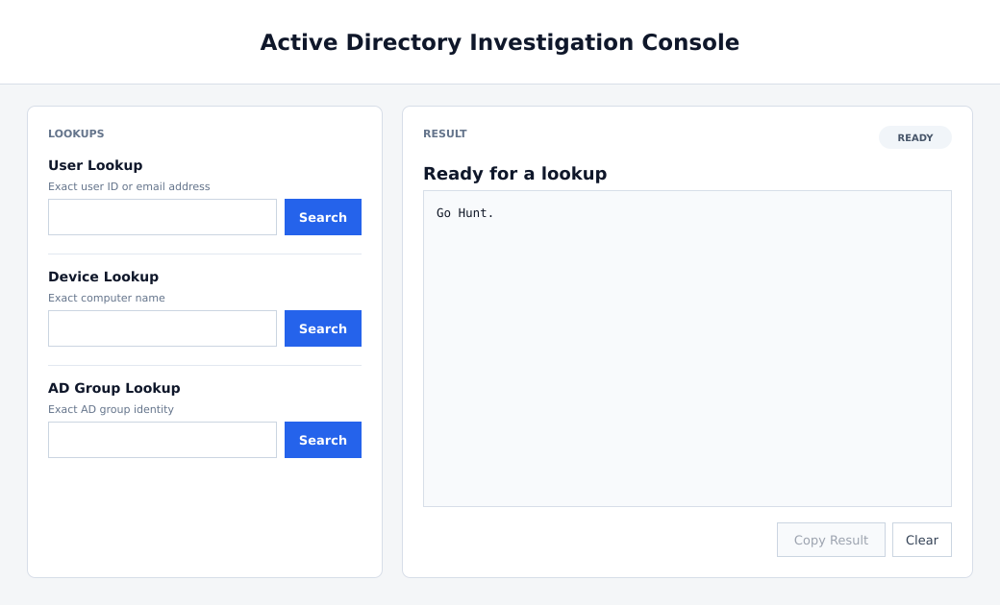

<h1 align="center">Active Directory Investigation Console</h1>

<p align="center">
  Fast, read-only Active Directory lookups for authorized investigations.
</p>

---

Active Directory Investigation Console is a PowerShell utility for exact user, computer, and AD group lookups through a simple WPF interface.

The console uses the current Windows and Active Directory security context and presents each result in one place for review or copying. It does not request or store separate credentials.

> Use the console only in Active Directory environments you own or are explicitly authorized to investigate.

## Install

You need a domain-connected Windows host with PowerShell, the RSAT Active Directory module, network access to Active Directory, and permission to read the requested objects.

```powershell
git clone https://github.com/delriscotechnologies/adinvestigationconsole.git
cd adinvestigationconsole
powershell.exe -File .\ADInvestigationConsole.ps1
```

If your organization restricts PowerShell execution, follow its approved execution policy and code-signing requirements.

## What it does

1. Searches for one user by exact user ID, email address, or User Principal Name.
2. Searches for one computer by exact computer name.
3. Searches for one AD group by exact group identity.
4. Formats successful results for review and optional clipboard copying.

Each lookup runs with the permissions of the current Windows session. The console does not perform broad directory discovery.

## Output

| Lookup | Evidence shown |
| --- | --- |
| User | User ID, department, email address, and OU path |
| Device | Computer name, possible department, OU path, and Distinguished Name |
| AD Group | Full group Distinguished Name |

The status badge reports whether the console is ready, found a result, needs review, or encountered an error. **Copy Result** is enabled only after a successful lookup.

## Demo



## Scope and limits

- Active Directory Investigation Console is intended for authorized, read-only directory investigations.
- It uses `Get-ADUser`, `Get-ADComputer`, and `Get-ADGroup` and does not create, modify, delete, or move Active Directory objects.
- Results depend on the objects visible to the current Windows and Active Directory security context.
- Lookups require exact identities; the console does not provide fuzzy search, directory enumeration, recursive group-membership analysis, or change auditing.
- OU display decodes escaped delimiters, backslashes, and hexadecimal UTF-8 sequences in Distinguished Names. This affects formatting, not the directory queries.
- `Possible Department` is inferred from the computer's OU hierarchy and is not an authoritative Active Directory department attribute.
- Directory results and copied clipboard contents may be sensitive and should be handled according to your organization's access and retention requirements.

See [SECURITY.md](SECURITY.md) for security and vulnerability-reporting guidance.

## License

Active Directory Investigation Console is available under the [MIT License](LICENSE).
